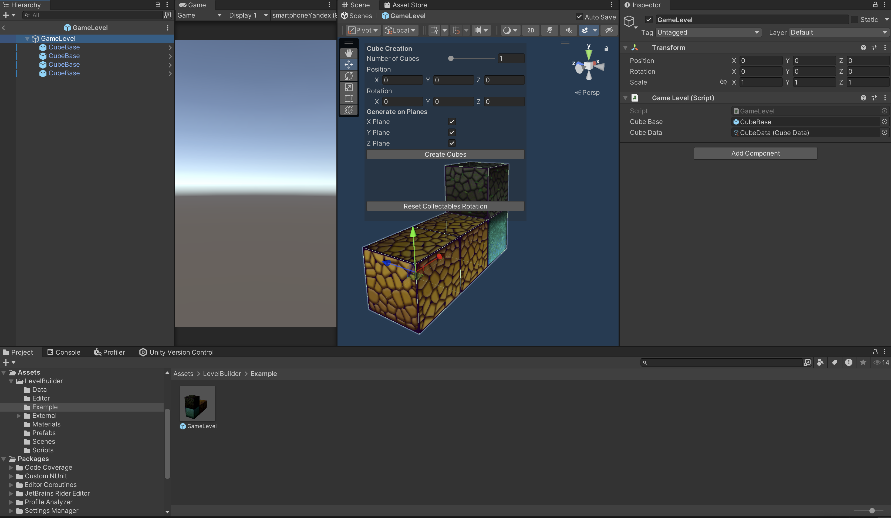
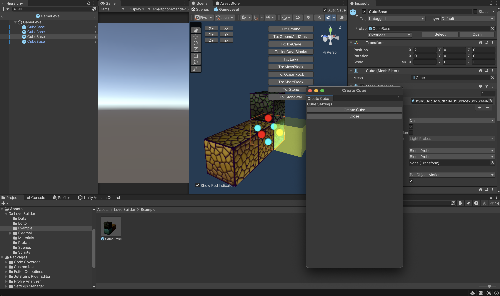

Unity Level Builder Tool
This Unity Level Builder Tool allows developers to quickly design and build cubic levels as prefabs, perfect for various types of games, including puzzle and adventure games. The tool leverages Unity's editor capabilities to streamline the level creation process, making it intuitive and efficient.

Features
Create cubic levels as prefabs directly in Unity.
Supports custom designs and configurations.
Lightweight and easy to integrate into your project.
Completely free to use and modify under the MIT License.

Download the Tool:
(https://github.com/Sparkah/Level-Builder/archive/refs/tags/Release.zip)

You can either clone the repository or download the .unitypackage file attached in the releases section.
For convenience, use the .unitypackage file for quick integration.

Open your Unity project.
Import the .unitypackage via Assets > Import Package > Custom Package.
Use the Tool:

Once imported, the tool will be accessible from the Unity Editor. Follow the provided usage guide or explore the editor options.

By selectine the whole Game Level prefab, you can generate large levels based on the settings selected

Be selecting single bloks, you can change its individual settings as well as selecting the sphere button to add new cubes next to it

Contributing
Feel free to fork this repository, make changes, and submit pull requests. Contributions are welcome!

License
This tool is distributed under the MIT License.
